# SOLO_Instance_segmentation (Pytorch Lightning implementation)

The project involved the implementation of the instance segmentation algorithm defined in paper: [SOLO](https://arxiv.org/abs/1912.04488). The main idea behind the paper is that different instance categories can be differentiated by their location and size in an image. The image is divided into SxS grids. Each grid cell is responsible for locating the instance's center which falls in the pixels it corresponds to in the original image.  
Size is handled by detecting at different levels of Feature Pyramid Network. Each level of the feature pyramid contributes in producing a prediction. The smallest level of the Feature pyramid network predicts the large objects and their masks while the largest level predicts the small objects.  
The Feature pyramid network uses the Resnet50 backbone as the model architecture.

## Network architecture

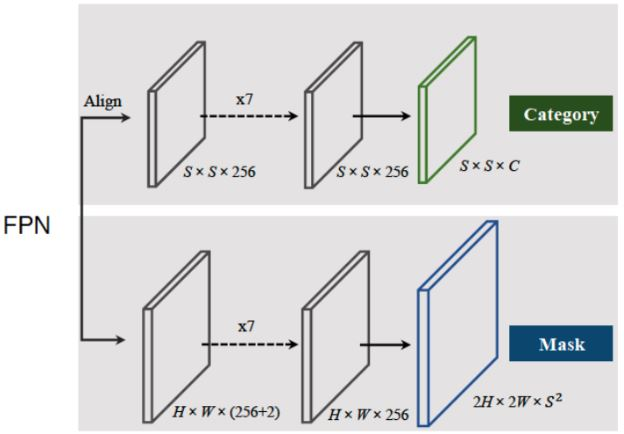

## Original dataset visualization

<b>Classes :</b>  
  Blue - Vehicles 
  Red - Animals 
  Green - People
  
<table>
  <tr>
      <td align = "center"> 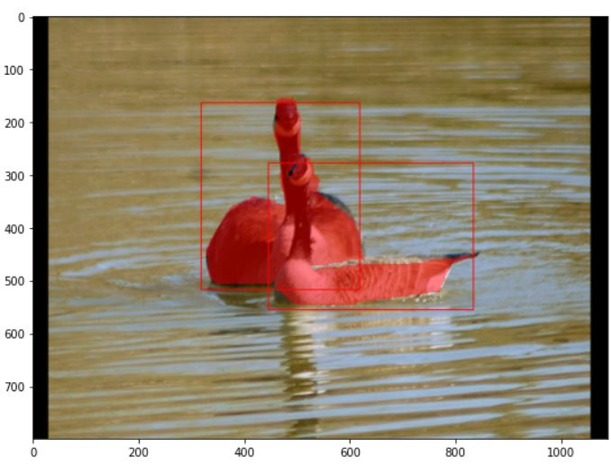 </td>
      <td align = "center"> 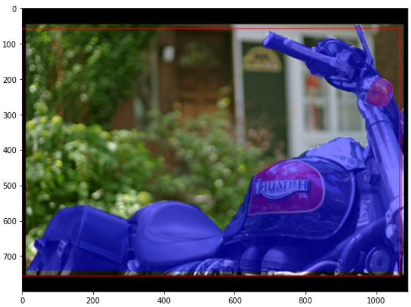 </td>
      <td align = "center"> 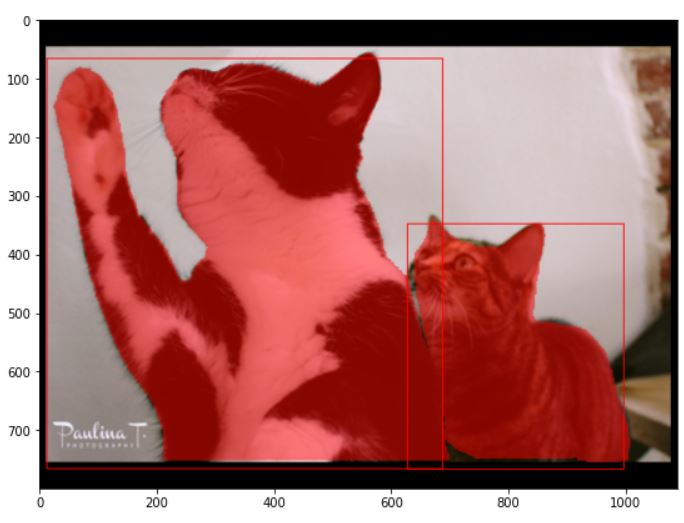 </td>
  </tr>
</table>

## Results

Below are some examples of the predictions given by the model:

<table>
  <tr>
      <td align = "center"> 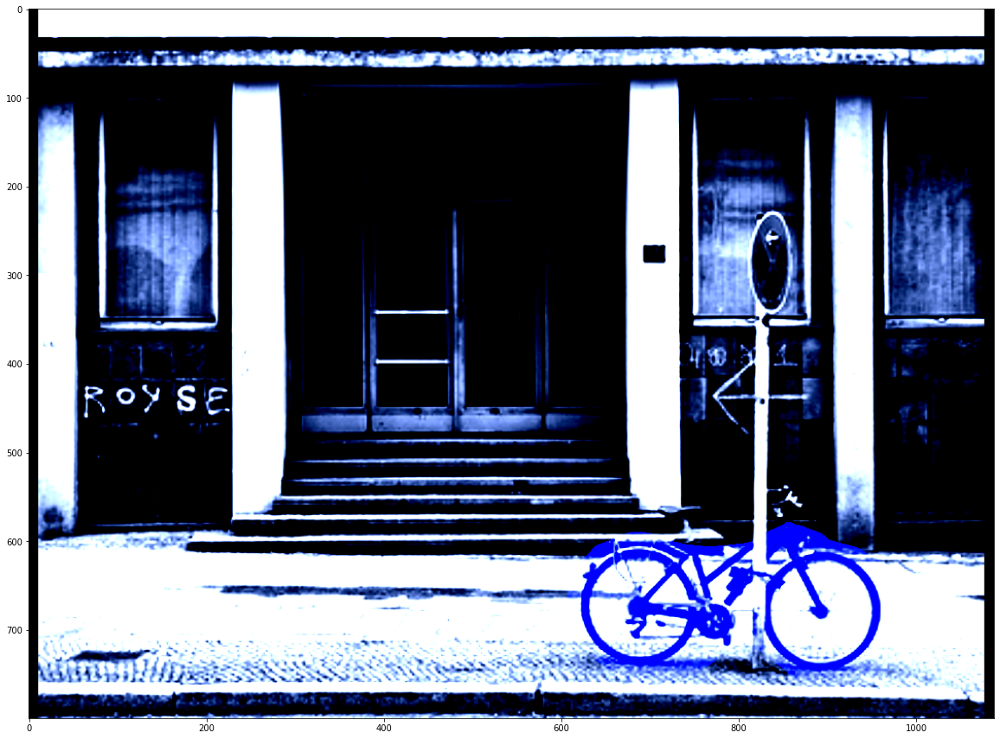 </td>
      <td align = "center"> 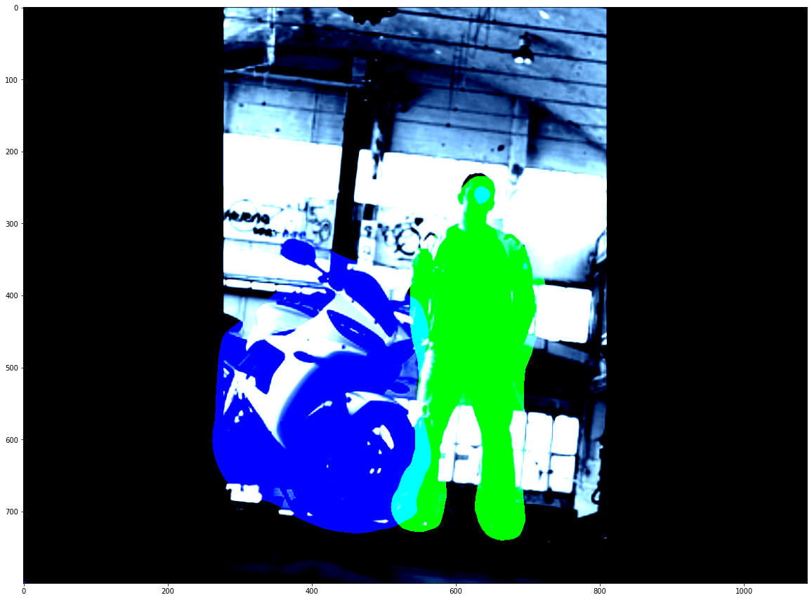 </td>
      <td align = "center"> 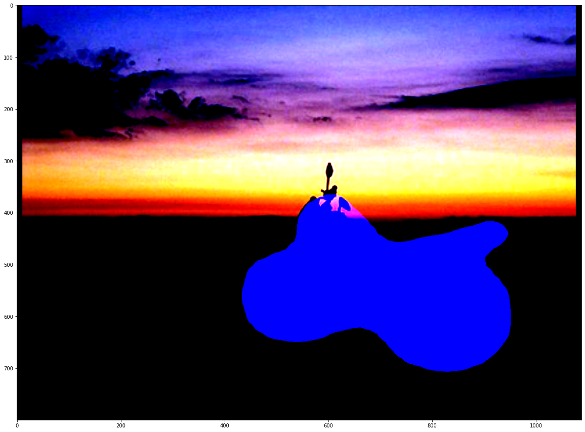 </td>
  </tr>
  <tr>
      <td align = "center"> 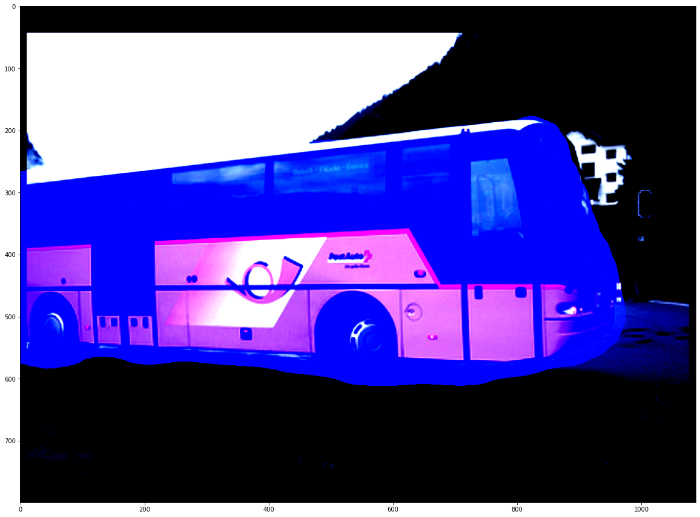</td>
      <td align = "center"> 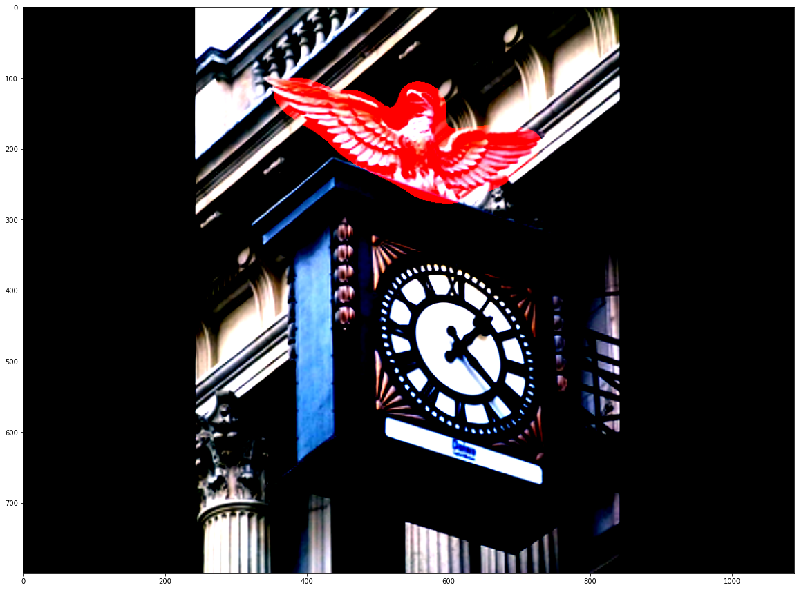 </td>
      <td align = "center"> 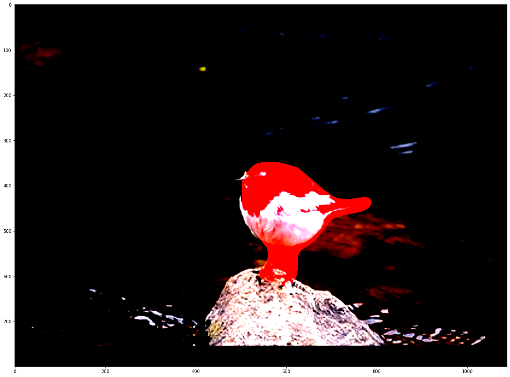 </td>
  </tr>
</table>

## Loss Curves

Following are the loss curves for training and validation:

<table>
  <tr>
      <td align = "center"> 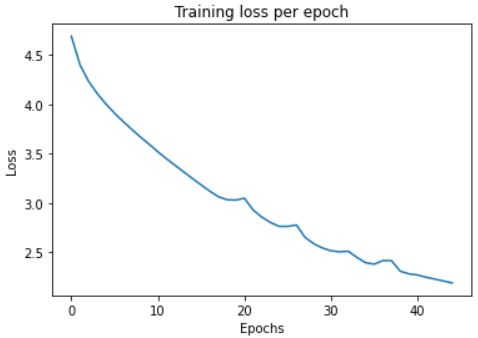 </td>
      <td align = "center"> 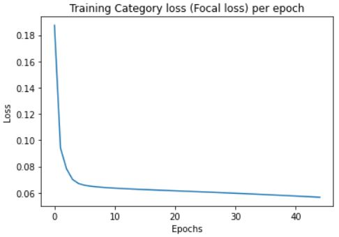 </td>
      <td align = "center"> 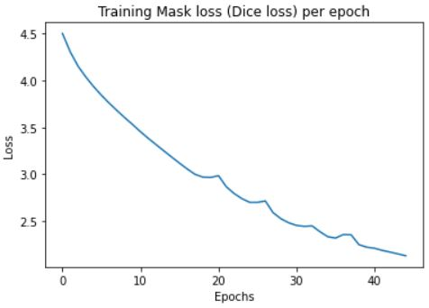 </td>
  </tr>
  <tr>
      <td align = "center"> Total training loss</td>
      <td align = "center"> Focal loss (Category) for training data </td>
      <td align = "center"> Dice loss (Mask) for training data </td>
  </tr>
</table>

<table>
  <tr>
      <td align = "center"> 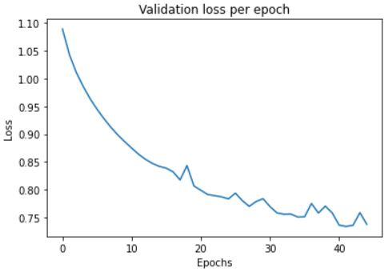 </td>
      <td align = "center"> 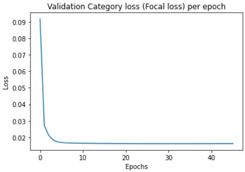 </td>
      <td align = "center"> 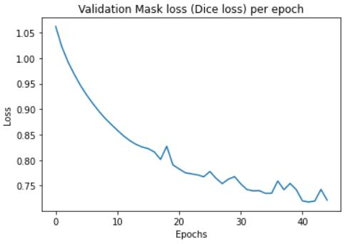 </td>
  </tr>
  <tr>
      <td align = "center"> Total Validation loss</td>
      <td align = "center"> Focal loss (Category) for validation data </td>
      <td align = "center"> Dice loss (Mask) for validation data </td>
  </tr>
</table>

## Hyperparameters 
* Focal Loss
    * alpha = 0.25, gamma = 2
* Mask Loss weight : 3
* Category Threshold:  0.2
* INS Threshold         : 0.5
* IoU Threshold         : 0.3 
* Learning rate         : 0.01 , 0.001 after epoch 27, 0.0001 after epoch 34
* Momentum              : 0.9
* Weight Decay          : 0.0001
* Num Epochs            : 45

